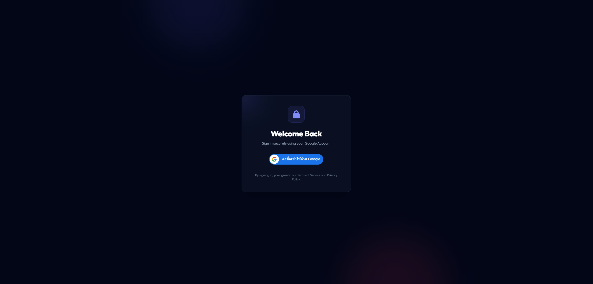
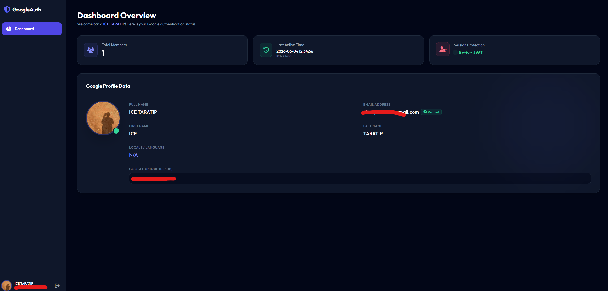

# Google Login System (PHP MVC + JWT + Google OAuth)

ระบบตัวอย่างการ Login ด้วย Google OAuth2 พัฒนาด้วย PHP (OOP + PDO) โครงสร้างแบบ MVC + Service Layer และใช้ JWT (HttpOnly Cookie) สำหรับการจัดการ session

Frontend ใช้ Tailwind CSS และ SweetAlert2 สำหรับ UI และแจ้งเตือน

---

## Screenshots

| Login Page | Dashboard |
| --- | --- |
|  |  |

---

## Features

- Google OAuth Login (GSI Redirect Flow)
- Double-Submit Cookie CSRF Protection (Google GSI Standard)
- JWT Authentication (HttpOnly Cookie Session)
- MVC + Service Layer Architecture
- PDO Database Layer (Singleton Connection)
- Middleware Authentication Protection
- Responsive UI (Tailwind CSS)
- SweetAlert2 Notifications
- Loading Skeleton Integration

---

## Tech Stack

- PHP 8.0+
- MySQL / MariaDB
- Tailwind CSS (v3 CDN)
- SweetAlert2
- Google Identity Services (GSI) SDK
- JWT (HMAC-SHA256)

---

## Project Structure

```text
Login-Google/
├── public/
│   ├── .htaccess
│   ├── index.php
│   └── assets/
├── src/
│   ├── Config/
│   │   ├── Database.php
│   │   └── Env.php
│   ├── Controllers/
│   │   ├── AuthController.php
│   │   └── DashboardController.php
│   ├── Services/
│   │   └── AuthService.php
│   ├── Repositories/
│   │   └── UserRepository.php
│   ├── Models/
│   │   └── User.php
│   ├── Middleware/
│   │   └── AuthMiddleware.php
│   └── Core/
│       ├── Router.php
│       ├── Request.php
│       ├── Response.php
│       ├── Session.php
│       └── JWT.php
├── views/
│   ├── layouts/
│   │   └── app.php
│   ├── auth/
│   │   └── login.php
│   ├── dashboard/
│   │   └── index.php
│   └── errors/
│       └── 404.php
├── storage/
├── .env
├── .env.example
├── .gitignore
├── composer.json
└── database.sql
```

---

## Installation

### 1. Database Setup
1. Create a MySQL database (e.g. `login_google`).
2. Import [database.sql](database.sql) schema into the database.

### 2. Environment Configurations
1. Copy `.env.example` to `.env`:
   ```bash
   cp .env.example .env
   ```
2. Configure your database details inside `.env`:
   ```env
   DB_HOST=127.0.0.1
   DB_DATABASE=login_google
   DB_USERNAME=root
   DB_PASSWORD=
   ```

### 3. Google OAuth Setup
1. Go to the [Google Cloud Console](https://console.cloud.google.com/).
2. Create OAuth 2.0 Web Application credentials.
3. Configure the following parameters:
   - **Authorized JavaScript origins**: `http://localhost`
   - **Authorized redirect URIs**: `http://localhost/Login-Google/auth/google/callback`
4. Update Google Client credentials in `.env`:
   ```env
   GOOGLE_CLIENT_ID=your_google_client_id
   GOOGLE_CLIENT_SECRET=your_google_client_secret
   ```

### 4. Running the Project
1. Place the project folder in your local web server root (e.g., XAMPP `htdocs/Login-Google`).
2. Start Apache and MySQL from XAMPP Control Panel.
3. Access the project in your browser:
   [http://localhost/Login-Google/]